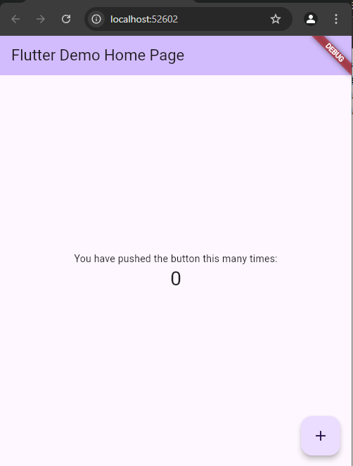
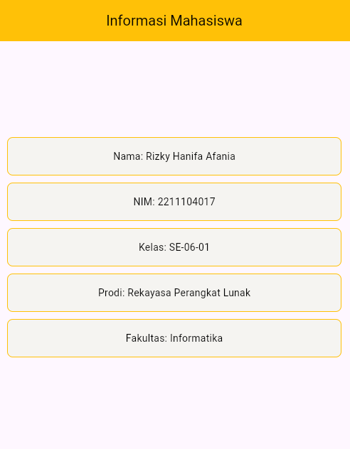

- Pengertian Dart
Dart adalah salah satu bahasa berorientasi objek yang dibangun oleh Google pada tahun 2011. Dart bersifat lintas platform yang artinya bisa digunakan pada sistem operasi yang berbeda, seperti Windows, Macos, Linux, dll. Dart bisa digunakan untuk mengembangkan aplikasi seluler, web, desktop, sisi server, dlll. Pada umumnya Dart digabungan dengan framework Flutter saat mengembangan mobile app. Tidak hanya itu, Dart juga bisa diimplementasikan dengan framework lain sesuai kebutuhan. Keuntungan menggunakan Dart adalah bahasa ini mudah dipelajari karena sintaksnya mirip dengan bahasa pemro graman C# dan Java.

- Pengertian Flutter
Flutter adalah framework yang bersifat multiplatform yaitu aplikasi yang dibuat bisa digunakan di berbagai platform, seperti iOS, wen, desktop, hingga mobile android. Flutter mempunyai dua komponen utama yaitu Flutter SDK dan Framework UI. Flutter SDK (Software Development Kit) adalah kumpulan tools yang digunakan untuk membangun aplikasi dengan berbagai komponen, sepertio emulator, compiler, debugger, dll. Sedangkan Framework UI adalah komponen untuk mengembangan antarmuka, seperti widget, navigasi, tombol, dll.

- Contoh Widget
Widget merupakan elemen dasar pada Flutter yang digunakan untuk membangun antarmuka pengguna (UI). Hampir semua yang ada di layar pengguna adalah kumpulan dari berbagai widget. Berikut adalah contoh widget:
1. Scaffold: digunakan untuk membuat halaman dasar pada Flutter
2. Container: digunakan untuk membungkus child - child dari berbagai tipe
3. Row: digunakan untuk membuat widget secara horizontal
4. Column:  digunakan untuk membuat widget secara vertikal
5. Padding: digunakan untuk memberikan jarak antar widget
6. Image: digunakan untuk menampilkan gambar
7. Text: digunakan untuk menampilkan teks di layar
8. Icon: digunakan untuk menampilkan ikon dari seticon bawaan Flutter

- Tampilan Emulator

- Tampilan Biodata
